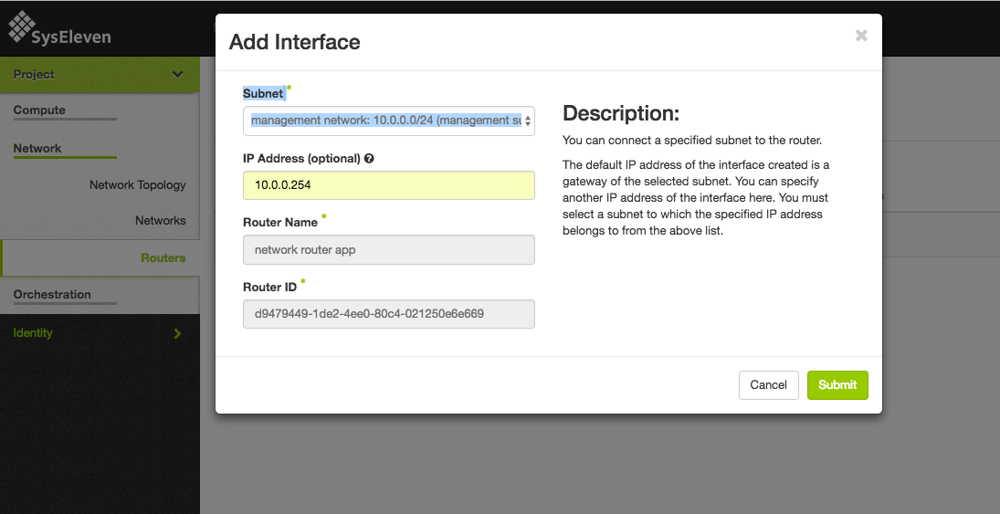

# SysEleven Stack Networking Service

[TOC]

## Overview

The SysEleven Stack Networking Service is built on the OpenStack Neutron project.

It enables Network-Connectivity-as-a-Service for other SysEleven Stack services, such as the Compute Service. It provides an API for users to define networks and the attachments into them.

You can manage your network both via our public OpenStack API endpoints, as well as using the [Dashboard](https://dashboard.cloud.syseleven.net).

## FAQ

### How do I connect two subnets with another?

#### Prerequisites

* Access to the [Dashboard](https://dashboard.cloud.syseleven.net)
* at least 2 existing routers/networks
* different IP ranges in both networks

#### Step One: Login

Sign in at the  [Dashboard](https://dashboard.cloud.syseleven.net)

#### Step Two: Create Interface on Router

To create a new interface on our router:
* Click on the left side bar, then "Network" --> "Router".
* Click on the first router you want to establish a connection with.
* In the new window, under "Interfaces", click on "Add Interfaces".
* Click on the router we want to connect to and add an IP under "IP" out of the ip-range from target router .
* Click "Submit".

Repeat the process with the other router.

#### Step Three: Add a Static Route

To add a static route:
* Click on the left side bar, then "Network" --> "Router".
* Click on the first router you want to establish a connection with.
* Click on "Static Route"
* Click "Add Static Route" and enter the ip-range from the target network and as "Nexthop" the same ip-adress as in Step Two

Repeat the process with the other router

#### Step Four: Creating the Host Route

To create the host route:
* Click on the left side bar, then "Network", then the network you want to share.
* Click on the subnet you want to connect to
* Click on "Edit Subnet" and go to "Subnet Details".
* Under "Host Routes" we can now set the route.
* Specify the ip range (e.g. 10.0.0.0/24) and the ip address of the specific router interface.
* Click "Submit" to save the host route

Repeat the process with the other subnet.

#### Conclusion

You connected two subnets, so they can communicate with another.

You also set up our own host routes and got to know the networking settings in the dashboard.
